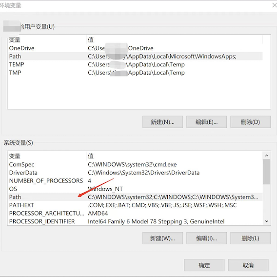

## 开始使用

### 配置

##### 安装

```shell
$ python setup.py install
```

安装成功后会在系统用户目录下创建两个文件夹

```sh
# Windows
C:\Users\\${user name}\.wing
C:\Users\\${user name}\bin

# Linux/MacOS
/Users/${user name}/.wing
/Users/${user name}/bin
```

##### 环境变量

**Windows：**

将`C:\Users\${user name}\bin`添加至系统环境变量





**Linux/MacOS：**

配置`~/bin`为可执行全局目录

```shell
$ vi ~/.bash_profile
$ export PATH=~/bin:$PATH
$ source ~/.bash_profile
```

### 初始化

##### 创建工作空间

添加工作空间对应的代码`git`库服务地址，如：

```shell
# 本地索引模式
# wing -space add {space name} {git host}
# such as:
$ wing -space add test git@github.com/iofomo
$ wing -space add test2 ssh://git@192.168.1.250:1022

# 云端索引模式
# wing -space add {space name} {git host} {manifest}
# such as:
$ wing -space add test git@github.com/iofomo manifest.git
$ wing -space add test2 ssh://git@192.168.1.250:1022 manifest.git
```

##### 获取代码

```shell
$ mkdir test
$ cd test

# wing init {space name} {branch/tag} {manifest file}
# such as:
$ wing init test master admin.xml
```

若为本地索引模式，则会在当前目录下自动创建一个空的模板索引文件（`.wing/manifests/admin.xml`），需要添加要同步的代码库映射关系。

```xml
<?xml version="1.0" encoding="UTF-8"?>
<manifest>

    <remote name="origin" fetch=".."/>

    <!-- branch -->
    <default revision="master" remote="origin" sync-j="4"/>

    <!-- TODO add git here ... -->
<!--    <project path="xxx" name="xxx.git" />    -->

</manifest>
```
